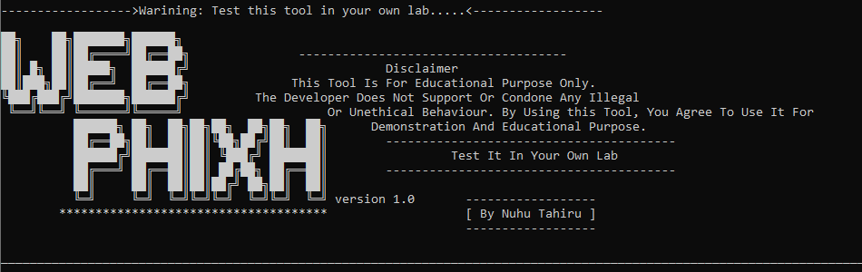

<h1 align="center">WebPhiXH</h1>

# Motive:
In the digital world, many of my friends were facing hacking issues. Being tech-savvy, I always helped my friends recover their accounts. To educate and impress them, I developed a powerful tool to combat phishing. I welcome anyone who considers phishing a critical issue to join me in promoting awareness and defending against it.
<p align="center">
  
  </p>
</p>

## Description:
**WebPhiXH** is a phishing tool that uses **Browser** as man-in-the-middle. This **Browser** get the input of the victim and sends to the main server for authentication.**WebPhiXH** is an open-source penetration testing framework designed for social engineering. **WebPhiXh ** has a number of testing site that allow you to make a believable attack quickly.

**Disclaimer:** This is only for testing purposes and can only be used where strict consent has been given. Do not use this for illegal purposes, period.

## Compatible OS

OS            | Support Level
--------------|--------------
Linux         | Not tested
MacOS         | Not tested
Windows(cmd)  | Support


## Installation:
##### 1. Install python
   
##### 2. Install php

##### 3. Install selenium
```bash
pip install selenium
```
##### 4. Install undetected-chromedriver
```bash
pip install undetected-chromedriver
```
##### 5. Install requests
```bash
pip install requests
```
##### 6. Install undetected-chromedriver
```bash
pip install undetected-chromedriver
```
##### 7. Clone this repo
```bash
git clone https://github.com/NuhuTahiru8/WebPhiXH.git
```
##### 8. Enter the directory
```bash
cd WebPhiXH
```
##### 9. Run the tool
```bash
python WebPhiXH.py
```


